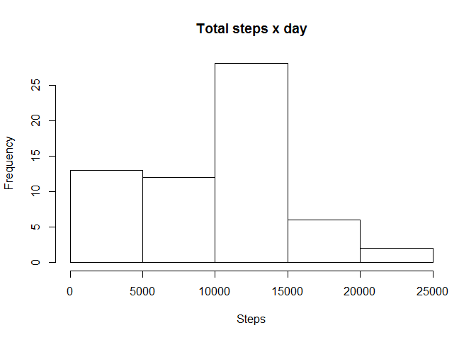
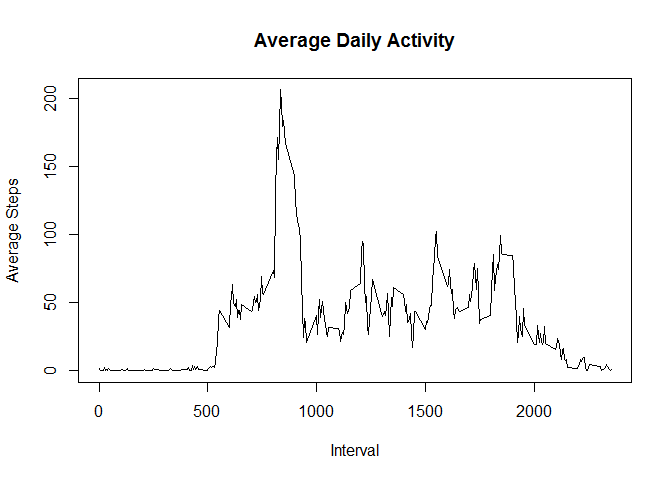
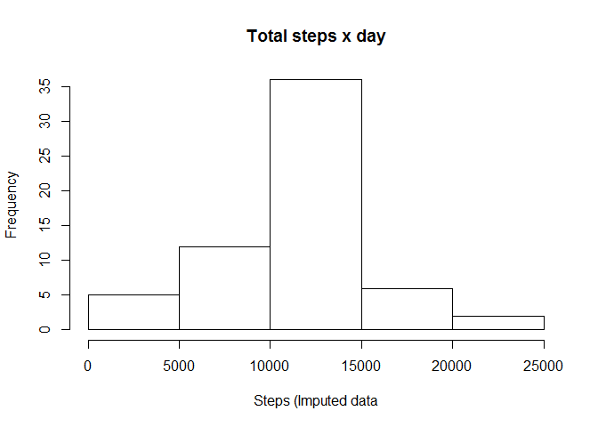
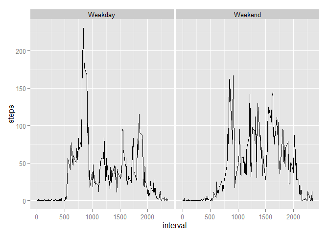

# Reproducible Research: Peer Assessment 1

##Loading and preprocessing the data
Loading data from csv Activity file. Variable date will be transformed using the lubridate
package.


```r
unzip("activity.zip")
dt <- read.csv("activity.csv", header = T)
library(lubridate)
dt$date <- ymd(dt$date)
```

##What is mean total number of steps taken per day?
The number of steps are pre-calcuated for each day. Data is retained in "sumSteps".
Please, note that missing values are ignored. The histogram is generated then. 
As a summary mean and median are shown for the table.


```r
sumSteps <- tapply(dt$steps, dt$date, sum, na.rm = T)
hist(sumSteps, main = "Total steps x day", xlab = "Steps")
```

 

```r
round(mean(sumSteps), digits = 0)
```

```
## [1] 9354
```

```r
round(median(sumSteps), digits = 0)
```

```
## [1] 10395
```

##What is the average daily activity pattern?
Following similar procedure from above, mean steps x interval are pre-calculated.
Data is retained in "meanSteps". A plot is showing mean of steps taken x interval.
Peak value, or with maximum number of steps, is identified.


```r
meanSteps <- tapply(dt$steps, dt$interval, mean, na.rm = T)
i <- as.numeric(levels(factor(dt$interval)))
plot(i, meanSteps, type = "l", main = "Average Daily Activity", 
     xlab = "Interval", ylab = "Average Steps")
```

 

```r
i[which(meanSteps == max(meanSteps))]
```

```
## [1] 835
```

##Imputing missing values
The number of missing values in the original data set is calculated. Imputation
strategy is using the mean value for the interval, if it is missing. The imputed
data is retained in a new data set, called "dt_imputed". As requested a new 
histogram with the number of steps taken each day is shown. We could observe that
the new histogram is less positive skew, or more centered. The mean and median
are getting closer.


```r
stepsNa <- sum(as.numeric(is.na(dt$steps)))
stepsNa
```

```
## [1] 2304
```

```r
dt_imputed <- dt
for(n in 1:nrow(dt_imputed)){
    if(is.na(dt_imputed[n,]$steps)){
        p <- which(i == dt_imputed[n,]$interval)
        dt_imputed[n,]$steps <- round(meanSteps[p], digits = 0)
    }
}
sumSteps <- tapply(dt_imputed$steps, dt_imputed$date, sum, na.rm = T)
hist(sumSteps, main = "Total steps x day", xlab = "Steps (Imputed data")
```

 

```r
round(mean(sumSteps), digits = 0)
```

```
## [1] 10766
```

```r
round(median(sumSteps), digits = 0)
```

```
## [1] 10762
```

##Are there differences in activity patterns between weekdays and weekends?
A new factor variable is created in the data set as requested. This variable will
be used to differentiate weekdays and weekends. A plot is generated using the 
ggplot2 package. Yes, we could observe a difference of activity between regular
weekdays and weekends.


```r
library(ggplot2)
wdWE <- function(d){
    if(wday(d) %in% c(1, 7)){
        a <- "Weekend"
    } else {
        a <- "Weekday"
    }
    return(a)
}
dt_imputed$wdWE <- as.factor(sapply(dt_imputed$date, wdWE))
meanStepsWdWe <- aggregate(steps ~ wdWE + interval, data = dt_imputed, mean)
qplot(interval, steps, data = meanStepsWdWe, facets=~wdWE, geom="line")
```

 
